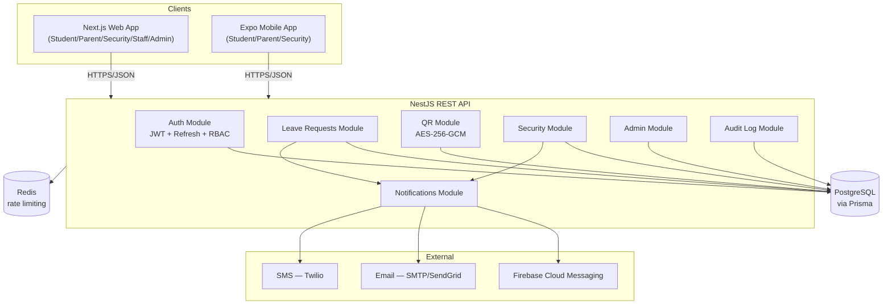
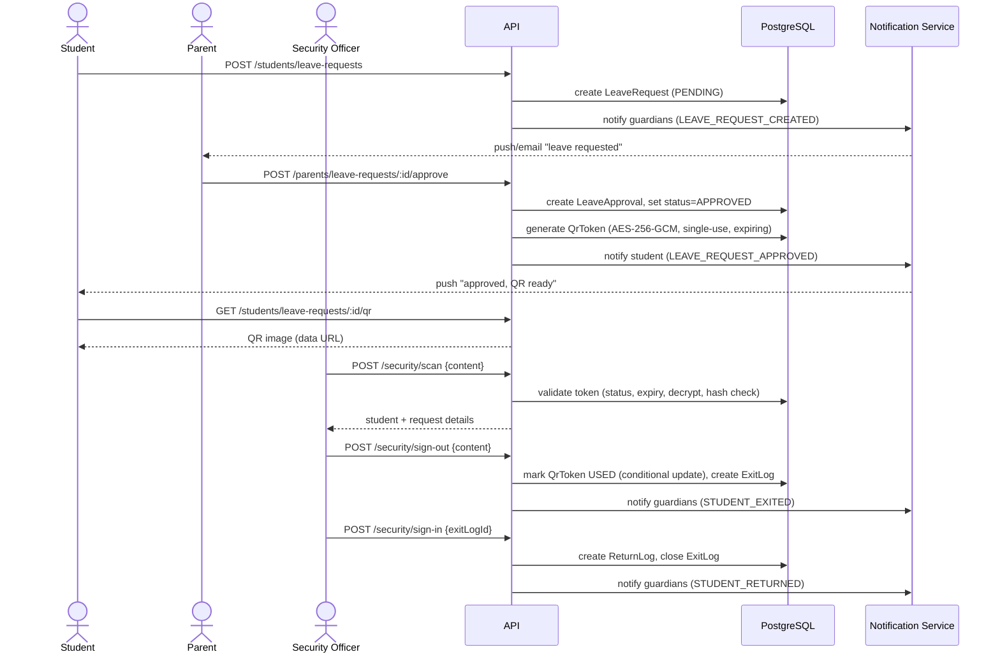

# System Architecture

President's College Leave Permission Management System (PCLS)

## Overview

PCLS is a monorepo with three deployable applications sharing one PostgreSQL
database through a single NestJS REST API:

| App | Path | Tech | Serves |
|---|---|---|---|
| API | `apps/api` | NestJS + Prisma + PostgreSQL | All clients below |
| Web | `apps/web` | Next.js (App Router) + Tailwind | Student, Parent, Security, Staff, Admin (browser) |
| Mobile | `apps/mobile` | React Native + Expo | Student, Parent, Security (phone) |

Staff and Admin are expected to work primarily from the web console (office
use); Student, Parent and Security are the three roles that act from the
field, so they get first-class native mobile screens as well as web access.

## High-level component diagram

## Request flow: leave approval → gate pass → exit → return

## Security model

- **AuthN**: JWT access tokens (short-lived, 15 min default) + opaque,
  hashed, rotating refresh tokens (30 days default) stored per-session in
  `refresh_tokens`, so a single device/session can be revoked without
  logging everyone out. Reuse of an already-rotated refresh token revokes
  every session for that user (theft heuristic).
- **AuthZ**: Role-based access control via `@Roles()` + a global `RolesGuard`.
  Five roles: `STUDENT`, `PARENT`, `SECURITY`, `STAFF`, `ADMIN`.
- **QR gate passes**: each pass is AES-256-GCM encrypted (tamper-evident —
  GCM's auth tag fails decryption if the payload is edited), carries a
  single-use security token (SHA-256 hashed at rest), and expires on a
  policy-configurable timer. Single-use is enforced with a conditional
  DB update (`WHERE status = 'ACTIVE'`) so concurrent scans can't double-spend
  one pass.
- **Rate limiting**: `@nestjs/throttler`, tightened further on `/auth/login`.
- **Audit trail**: every security-relevant action (logins, approvals,
  QR generation/scans, sign-out/in, user/policy changes) is written to an
  append-only `audit_logs` table.
- **Transport**: HTTPS everywhere in production (terminated at the load
  balancer/ingress); `helmet` sets baseline security headers.

## Data model

See [`apps/api/prisma/schema.prisma`](../apps/api/prisma/schema.prisma) for
the authoritative schema and [`ER_DIAGRAM.md`](./ER_DIAGRAM.md) for the
entity-relationship diagram.

## Why this stack

- **NestJS**: opinionated module/DI structure scales well to the number of
  domains here (auth, leave requests, QR, security, notifications, admin)
  without turning into a pile of loose Express routes.
- **Prisma**: type-safe queries generated from one schema, shared migration
  history, straightforward to seed for demos.
- **Next.js App Router**: role-scoped route groups map naturally onto the
  five portals; server/edge features aren't required here since the app is
  a thin client over the REST API, but the framework leaves room to add SSR
  data-fetching later without a rewrite.
- **Expo**: one React Native codebase for iOS + Android, with first-class
  camera (QR scanning) and push notification APIs, and OTA updates via EAS
  for fast iteration without app-store review on every fix.
