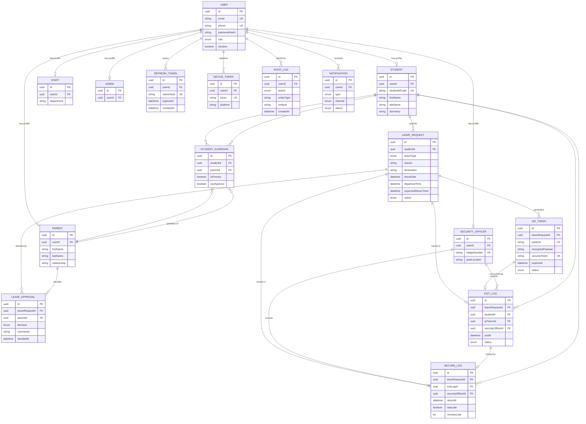

# Entity-Relationship Diagram

Generated from [`apps/api/prisma/schema.prisma`](../apps/api/prisma/schema.prisma).
To regenerate an interactive version, run `npx prisma generate` with the
[`prisma-erd-generator`](https://github.com/keonik/prisma-erd-generator)
plugin, or open the schema in Prisma's VS Code extension.

